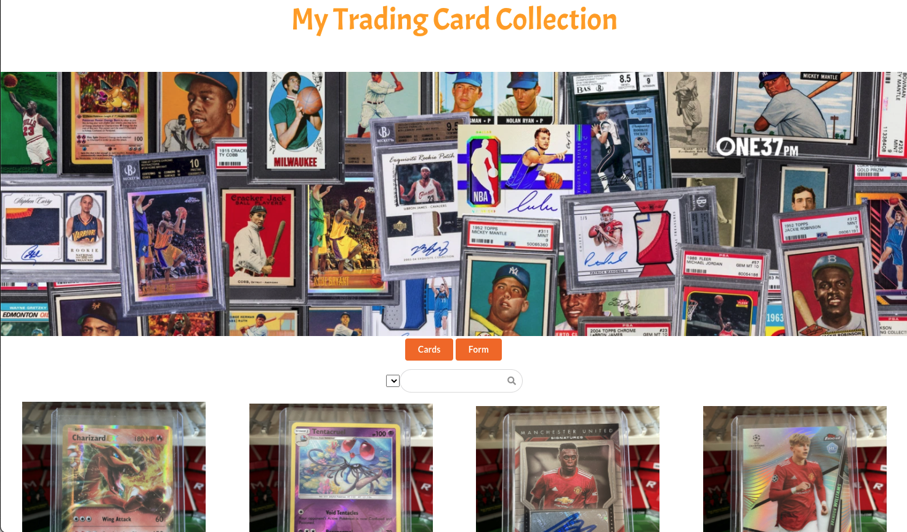

# Trading Card Collection

This app allows you to add your trading cards to a database and display them on a url. You can give you card an image, name, year, description, and collection. There is a search bar that allows you to search by the name. The database for this app is in another repository at [Trading Card Collection Database](https://github.com/bsmitty815/trading-card-collection-db)

# Getting Started with Create React App

This project was bootstrapped with [Create React App](https://github.com/facebook/create-react-app).

# Install Your Own Copy
Follow these instructions to install your own copy on your computer

1. Fork the repo.
2. Then click the green button on the top right
3. Copy the SSH link
4. Open up your terminal on your computer
5. Type `git clone` plus SSH copied link and press enter
6. type `cd trading-card-collection` and press enter
7. type `npm start` in the terminal to get your the app server up and running

### `npm start`

Runs the app in the development mode.\
Open [http://localhost:3000/cards](http://localhost:3000/cards) to view it in the browser. Not you must have the database running as well to see the data on the screen.

The page will reload if you make edits.

## Learn More

You can learn more in the [Create React App documentation](https://facebook.github.io/create-react-app/docs/getting-started).

To learn React, check out the [React documentation](https://reactjs.org/).

# Resources
This application was built using React, HTML, CSS, JavaScript, and Semantic UI React
